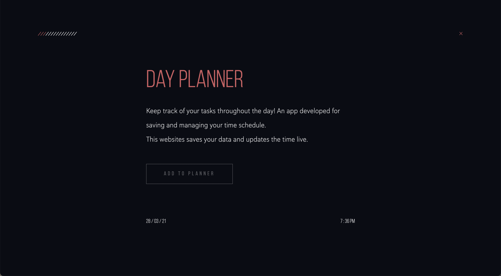
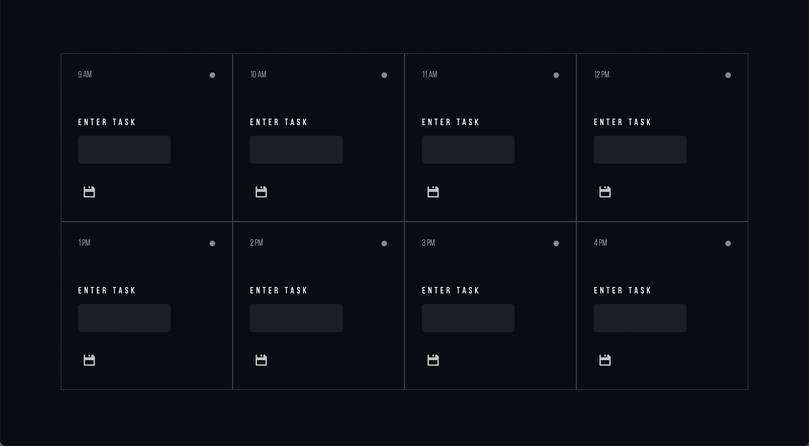

# Time Updated Day Planner

## How does it work?

This is a planner to keep track of your daily activities! You are able to save each task and come back to it later - pretty cool! The color coding of each block also changes depending on the time of day :)

## Why do this?

Everyone has a busy schedule? It helps improve organisation by creating a table of tasks to keep track of. It also helps individuals to achieve challenging goals - keep on dreamer ;) Stop being lazy and get your housework done!

## Deployment

The day planner has been deployed at:
[Day Planner](https://punkinut.github.io/day-planner/)

## Landing Page

## Day Planner

## Final Notes
I hope you enjoyed organising your life - happy coding :)

